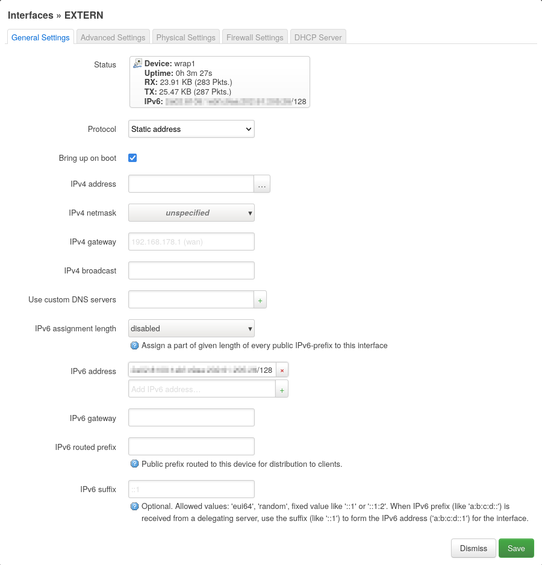
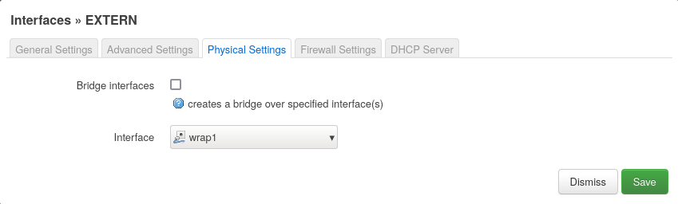
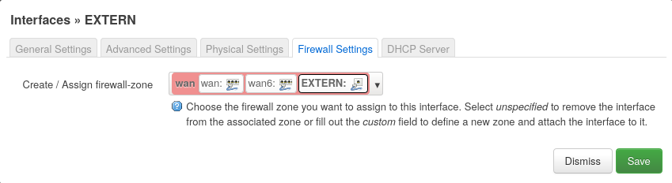
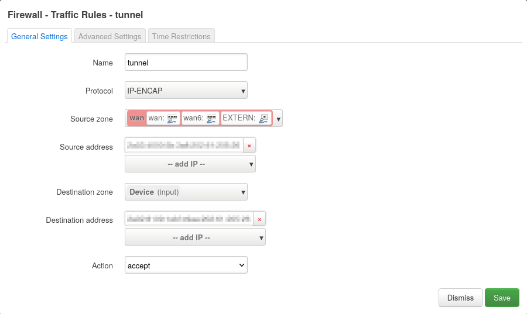
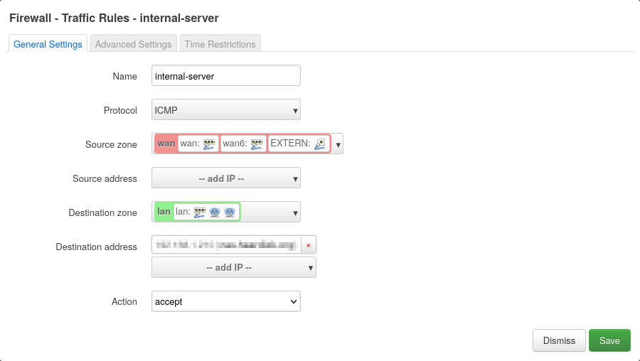

# Global IPv4 Address despite DS-Lite

__Sven Haardiek, 2022-01-29__

My ISP is using [DS-Lite](https://en.wikipedia.org/wiki/IPv6_transition_mechanism#Dual-Stack_Lite_.28DS-Lite.29) for their customers.
This means they are using a [Carrier-grade NAT](https://en.wikipedia.org/wiki/Carrier-grade_NAT) to be able to use a single IPv4 address for multiple of their customers.
The reasons for this are pretty obvious, since getting blocks of IPv4 addresses is getting harder and probably also more expensive.
Furthermore, running an IPv6 only network is no option, because a lot of servers are only reachable via IPv4.

For me this has the disadvantage that I can not host services via IPv4 in my home.
This means that my services are not available in networks where no IPv6 is configured or simply broken... and there are a lot of those.

To fix this problem I decided to rent an external VM from a Cloud Provider and *re-use* its IPv4 address for a machine in my own private network.

A small note: All IP addresses are arbitrary and IP addresses from the images are obfuscated.

## The easy Way: socat

So if you have a home server whose service is reachable via an IPv6 address on a specific port, let's say `2e5b:9a11:b0a8:fdd2:258f:433e:e0bc:9544` and `443`,
you can get yourself a cheap external VM with an IPv4 and IPv6 address and relay all IPv4 traffic for this specific port to your home server using [socat](http://www.dest-unreach.org/socat/).

Simply run

```bash
$ socat 'TCP4-LISTEN:443,fork' 'TCP6:[2e5b:9a11:b0a8:fdd2:258f:433e:e0bc:9544]:443'
```

on your external VM and every incoming traffic (TCP) on your external IPv4 address, port `443` is getting relayed to your home server.

The advantage of this is that this is pretty easy to setup and to understand.
The disadvantage is that every network package has to be handled by `socat` in the user space.
This adds latency and also will use more resources for bigger data.
Also it only works for a single port and for limited protocols.
To support multiple protocols or ports you have to start multiple `socat`s.

## The hard Way: 4in6, DNAT, SNAT and Routing Tables

Next we will try to do the relay in the kernel space to speed up the whole process.

### Prerequisites

The prerequisites for this chapter are more complex.

What you definitely need is an external VM with an IPv4 address and multiple IPv6 addresses,
and also multiple IPv6 addresses from your ISP, for your home setup.
I got a `/64` IPv6 subnet for both. As far as I know, this is quite usual.

I used [Debian](https://www.debian.org/index.en.html) as the operating system on the external server.
So network setup scripts can look a little bit different on other operating systems.

At home, I used an [OpenWRT](https://openwrt.org/) router for the network configuration.
You will see screenshots from its UI later on.
You can use other software for network configuration,
e.g. [pfSense](https://www.pfsense.org/), or you should also be able to do this directly on your home server, if you like.

So, with this in mind, let's dive into it.

### The Tunnel

Our goal is to route IPv4 traffic from the external server to my home setup and this is where the first problem occurs.
My home setup is using DS-Lite, so we can not simply route IPv4 traffic there.
But we can route IPv6 traffic.
That is why we need to use the internet interoperation mechanism [4in6](https://en.wikipedia.org/wiki/4in6) and create an IPv6 tunnel between our external server and the OpenWRT router.
Through this tunnel we can then route IPv4 Traffic.

So, let's first take a look at the network configuration of my external server:

```bash
$ ip a
...
2: eth0: <BROADCAST,MULTICAST,UP,LOWER_UP> mtu 1500 qdisc pfifo_fast state UP group default qlen 1000
    link/ether e6:2f:c7:68:14:21 brd ff:ff:ff:ff:ff:ff
    altname enp0s3
    altname ens3
    inet 231.201.224.144/22 brd 231.201.227.255 scope global eth0
       valid_lft forever preferred_lft forever
    inet6 54a0:6231:d015:6ef9:e42f:c7ff:fe68:1421/64 scope global 
       valid_lft forever preferred_lft forever
    inet6 fe80::e42f:c7ff:fe68:1421/64 scope link 
       valid_lft forever preferred_lft forever
```

and at the network configuration file of the server

```
$ cat /etc/network/interfaces
...
auto eth0
iface eth0 inet static
    address 231.201.224.144/22
    gateway 231.201.223.1

iface eth0 inet6 static
    address 54a0:6231:d015:6ef9:e42f:c7ff:fe68:1421/64
    gateway fe80::1
```

So, I have the public IPv4 address `231.201.224.144` and additional I have the IPv6 address `54a0:6231:d015:6ef9:e42f:c7ff:fe68:1421` from the IPv6 subnet `54a0:6231:d015:6ef9::/64`.

My home setup has the IPv6 subnet `2e5b:9a11:b0a8:fdd2::/64`.

Since the IPv4 address is later completely forwarded to my home setup,
I decided to use the existing IPv6 address to manage the server.

So, for the endpoint of the tunnel we need two additional IPv6 addresses.
One on the external server and one on the OpenWRT Router.
I decided to derive the IPv6 addresses from the public IPv4 address and ended up with `54a0:6231:d015:6ef9:231:201:224:144` for the external server and `2e5b:9a11:b0a8:fdd2:231:201:224:144` for the OpenWRT Router.

So, let's first create the tunnel. I called it `wrap1` on the external server:

```bash
# Add the ipv6 address to the existing interface
$ ip -6 addr add 54a0:6231:d015:6ef9:e42f:c7ff:fe68:1421/128 dev eth0
# Create the tunnel
$ ip -6 tunnel add wrap1 mode ipip6 remote 2e5b:9a11:b0a8:fdd2:231:201:224:144 \
    local 54a0:6231:d015:6ef9:231:201:224:144 dev eth0
```

In the Debian `ifupdown` configuration it looks like this

```
...
iface eth0:0 inet6 static
  address 54a0:6231:d015:6ef9:231:201:224:144/128

auto wrap1
iface wrap1 inet manual
  pre-up ifup -v eth0:0
  pre-up ip -6 tunnel add wrap1 mode ipip6 remote 2e5b:9a11:b0a8:fdd2:231:201:224:144 local 54a0:6231:d015:6ef9:231:201:224:144 dev eth0
  up ip -6 link set dev wrap1 up
  post-down ip -6 tunnel delete wrap1
  post-down ifdown -v eth0:0
```

So the result should look like this

```bash
$ ip a
...
2: eth0: <BROADCAST,MULTICAST,UP,LOWER_UP> mtu 1500 qdisc pfifo_fast state UP group default qlen 1000
    link/ether e6:2f:c7:68:14:21 brd ff:ff:ff:ff:ff:ff
    altname enp0s3
    altname ens3
    inet 231.201.224.144/22 brd 231.201.227.255 scope global eth0
       valid_lft forever preferred_lft forever
    inet6 54a0:6231:d015:6ef9:231:201:224:144/128 scope global deprecated 
       valid_lft forever preferred_lft 0sec
    inet6 54a0:6231:d015:6ef9:e42f:c7ff:fe68:1421/64 scope global 
       valid_lft forever preferred_lft forever
    inet6 fe80::e42f:c7ff:fe68:1421/64 scope link 
       valid_lft forever preferred_lft forever
3: ip6tnl0@NONE: <NOARP> mtu 1452 qdisc noop state DOWN group default qlen 1000
    link/tunnel6 :: brd :: permaddr 820f:fc13:b957::
7: wrap1@eth0: <POINTOPOINT,NOARP,UP,LOWER_UP> mtu 1452 qdisc noqueue state UNKNOWN group default qlen 1000
    link/tunnel6 54a0:6231:d015:6ef9:231:201:224:144 peer 2e5b:9a11:b0a8:fdd2:231:201:224:144 permaddr 668b:5e05:74b0::
    inet6 fe80::648b:5eff:fe05:74b0/64 scope link 
       valid_lft forever preferred_lft forever
```

Okay, so one endpoint of the tunnel is created. Let's move to the OpenWRT router and set up the other end.

The configuration is more or less the same.
Unfortunately it seems like there is no package to configure `4in6` in OpenWRT via the web UI or using the command line configuration tool.
So, we have to configure it manually.
At least parts of it.

First we create the tunnel the same way we created it on the other side with switched remote and local address.

```bash
$ ip -6 tunnel add wrap1 mode ipip6 remote 54a0:6231:d015:6ef9:231:201:224:144 local 2e5b:9a11:b0a8:fdd2:231:201:224:144
```

To create the tunnel interface on boot, I created an init script `/etc/init.d/tunnel`

```bash
#!/bin/sh /etc/rc.common

START=19

start() {
	ip -6 tunnel add wrap1 mode ipip6 remote 54a0:6231:d015:6ef9:231:201:224:144 local 2e5b:9a11:b0a8:fdd2:231:201:224:144
}

stop() {
	ip -6 tunnel delete wrap1
}
```

and enabled it

```
$ /etc/init.d/tunnel enable
```

For details, take a look at the [Init Scripts article in the OpenWRT Wiki](https://openwrt.org/docs/techref/initscripts).

Now we are using the web UI to create a new interface under **Network->Interfaces** with

* a static configuration assigning the IPv6 `62e5b:9a11:b0a8:fdd2:231:201:224:144/128`:
  

* the tunnel interface `wrap1` as an physical interface:
  

* the firewall-zone `wan`:
  

We also have to open the firewall for IP traffic (protocol 4) where the source IPv6 is the tunnel endpoint on the external server and the destination IPv6 is the tunnel endpoint on the OpenWRT Router.



### DNAT, SNAT and Routing

So now that we established an IPv6 tunnel, let's think about routing IPv4 traffic through it.

#### The external Server

We will go through the different steps and configurations using a ping as example.
Let's say the private IP of our home server is `192.168.1.210` in the network `192.168.1.0/24`.
We assume that the ping request is sent from the IPv4 address `77.44.230.220` to our public IP `231.201.224.144`, like

```
IP 77.44.230.220 > 231.201.224.144: ICMP echo request, id 134, seq 1, length 64
```

As you can see, I will use the `tcpdump` output for explanations.

If we do nothing, the package would simply be answered by our external server,
since it has the IPv4 address `231.201.224.144` assigned.
To circumvent this, we use [DNAT](https://en.wikipedia.org/wiki/Network_address_translation#DNAT) to change the destination IPv4 address of the package to `192.168.1.210` before routing.

This can be done using [iptables](https://de.wikipedia.org/wiki/Iptables):

```bash
$ iptables -t nat -A PREROUTING -i eth0 -j DNAT --to 192.168.1.210
```

Now the destination IPv4 is not the public IP anymore and the external server does not answer directly,
but the external server still does not know what to do with this package.
That is why we create a route to our local network via the IPv6 tunnel.

```bash
$ ip -4 route add 192.168.1.210/24 dev wrap1
```

This now looks like this:

```
eth0  In  IP 77.44.230.220 > 231.201.224.144: ICMP echo request, id 141, seq 1, length 64
wrap1 Out IP 77.44.230.220 > 192.168.1.210: ICMP echo request, id 141, seq 1, length 64
eth0  Out IP6 54a0:6231:d015:6ef9:231:201:224:144 > 2e5b:9a11:b0a8:fdd2:231:201:224:144: DSTOPT IP 77.44.230.220 > 192.168.1.210: ICMP echo request, id 141, seq 1, length 64
```

We see here the incoming package, the change of the destination IPv4 address and the package entering in the IPv6 tunnel.

So, let's now assume the home server is doing everything correctly and we get an ICMP echo reply from the tunnel:

```
eth0  In  IP6 2e5b:9a11:b0a8:fdd2:231:201:224:144 > 54a0:6231:d015:6ef9:231:201:224:144: DSTOPT IP 192.168.1.210 > 77.44.230.220: ICMP echo reply, id 141, seq 1, length 64
wrap1 In  IP 192.168.1.210 > 77.44.230.220: ICMP echo reply, id 141, seq 1, length 64
```

The IPv4 package leaves the tunnel,
but now we have the answer to the ping with a wrong source IPv4 address.

We can correct this by using SNAT to change the source IPv4 back to our public IPv4:

```bash
iptables -t nat -A POSTROUTING -o eth0 -j SNAT --to 231.201.224.144
```

This results in:

```
eth0  Out IP 231.201.224.144 > 77.44.230.220: ICMP echo reply, id 141, seq 1, length 64
```

which causes our reply to be sent to the correct destination.

As a Debian `ifupdown` configuration, this would look like:

```
...
iface eth0:0 inet6 static
  address 54a0:6231:d015:6ef9:231:201:224:144/128

auto wrap1
iface wrap1 inet manual
  pre-up ifup -v eth0:0
  pre-up ip -6 tunnel add wrap1 mode ipip6 remote 2e5b:9a11:b0a8:fdd2:231:201:224:144 local 54a0:6231:d015:6ef9:231:201:224:144 dev eth0
  up ip -6 link set dev wrap1 up
  post-up ip -4 route add 192.168.1.210/24 dev wrap1
  post-up iptables -t nat -A PREROUTING -i eth0 -j DNAT --to 192.168.1.210
  post-up iptables -t nat -A POSTROUTING -o eth0 -j SNAT --to 231.201.224.144
  pre-down iptables -t nat -D POSTROUTING -o eth0 -j SNAT --to 231.201.224.144
  pre-down iptables -t nat -D PREROUTING -i eth0 -j DNAT --to 192.168.1.210
  post-down ip -6 tunnel delete wrap1
  post-down ifdown -v eth0:0
```

#### The OpenWRT Router

So, now that we have configured the external server, let's take a look at the OpenWRT router.

Here it starts with the IPv6 tunnel package on the physical `wan` interface (mine is `eth0.2`), which is then unpacked to the `wrap1` interface:

```
eth0.2 IP6 54a0:6231:d015:6ef9:231:201:224:144 > 2e5b:9a11:b0a8:fdd2:231:201:224:144: DSTOPT IP 77.44.230.220 > 192.168.1.210: ICMP echo request, id 142, seq 1, length 64
wrap1 IP 77.44.230.220 > 192.168.1.210: ICMP echo request, id 143, seq 1, length 64
```

Here we have to allow incoming traffic to `192.168.1.210` from `wan` to `lan`.
For this test, I only allowed ICMP, but you probably want to allow more, like TCP port 443 for HTTPS or something.




The package is now automatically routed to the `lan` interface (mine is `br-lan`) and from there through the internal network to the home server.
There the ping is answered and the answer lands again on the `lan` interface

```
br-lan IP 77.44.230.220 > 192.168.1.210: ICMP echo request, id 146, seq 1, length 64
br-lan IP 192.168.1.210 > 77.44.230.220: ICMP echo reply, id 146, seq 1, length 64
```

The problem here is, that this package would now be routed through the default gateway of the router via the regular `wan` interface.
But we want the package to be routed via the `wrap1` tunnel interface instead.
For that, we create another routing table only for packages with the source IPv4 `192.168.1.210` and route per default to `wrap1`:

```
ip rule add from 192.168.1.210/32 table 42
ip route add default dev wrap1 table 42
```

I also added this to the `/etc/init.d/tunnel` script, which now looks like this:

```bash
#!/bin/sh /etc/rc.common

START=19

start() {
	ip -6 tunnel add wrap1 mode ipip6 remote 54a0:6231:d015:6ef9:231:201:224:144 local 2e5b:9a11:b0a8:fdd2:231:201:224:144
	ip rule add from 192.168.1.210/32 table 42
	ip route add default dev wrap1 table 42
}

stop() {
	ip rule delete table 42
	ip route delete default table 42
	ip -6 tunnel delete wrap1
}
```

Now, the ping reply is routed to the `wrap1` interface and then routed through the tunnel.

```
wrap1 IP 192.168.1.210 > 77.44.230.220: ICMP echo reply, id 167, seq 483, length 64
eth0.2 IP6 2e5b:9a11:b0a8:fdd2:231:201:224:144 > 54a0:6231:d015:6ef9:231:201:224:144: DSTOPT IP 192.168.1.210 > 77.44.230.220: ICMP echo reply, id 167, seq 550, length 64
```

From there, the external server does its job and, as previously described, sends the package to the correct destination.

## Notes and Numbers

There are some big differences between the two setups I described.

* In our second setup the whole network traffic from the home server is routed via the public IP.
  That includes incoming and outgoing traffic and all protocols.
  You could probably use `DNAT` and `SNAT` only on specific ports on the external server and so use a single public IPv4 address for multiple internal server.
* The setup is completely transparent, so that the internal server can see the IPv4 address of the requesting server.
* The whole DNAT, SNAT and routing is done within kernel space,
  which should use less resources and should also be much faster.
  Running a very quick test, with 100 small `curl` requests, this method was approximately 10% faster than using `socat`.
  It would be interesting to compare with more data.
  Maybe I will do this someday and add the result to this article.

At the end, I did some ping testing.
First with the public IPv4 and with the public IPv6 address of my home server to get a hint of how much overhead the whole setup is adding.

```bash
$ ping -4 231.201.224.144 -c 100 && ping -6 2e5b:9a11:b0a8:fdd2:258f:433e:e0bc:9544 -c 100
...
--- 231.201.224.144 ping statistics ---
100 packets transmitted, 100 received, 0% packet loss, time 99173ms
rtt min/avg/max/mdev = 38.954/42.947/62.958/3.313 ms
...
--- 2e5b:9a11:b0a8:fdd2:258f:433e:e0bc:9544 ping statistics ---
100 packets transmitted, 100 received, 0% packet loss, time 99152ms
rtt min/avg/max/mdev = 34.166/37.296/44.453/1.846 ms
```

Which results in an approximately 5-6ms difference, which I think is good enough for my homelab.
