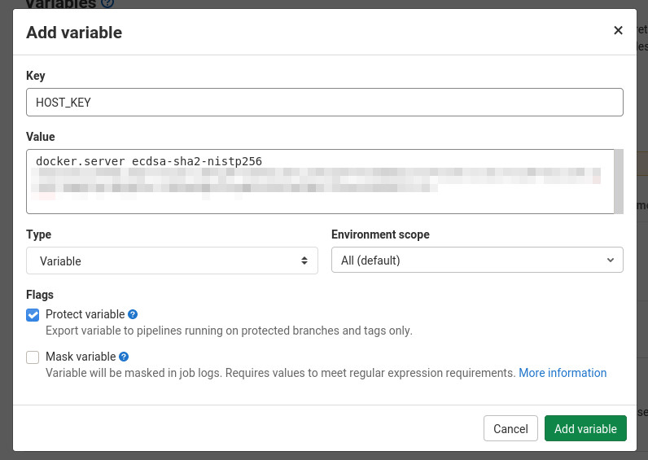
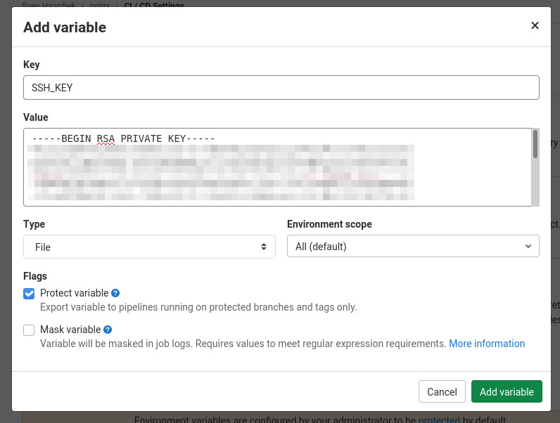

# Set up and maintain Infrastructure with Docker and GitLab

__Sven Haardiek, 2020-10-20__

Companies and Organization need different services for their daily work.
Things like chat systems to communicate, wikis or very basic services like DNS or DHCP.

In smaller companies and organization those services are often set up and maintained manually, since automation would mean an initial overhead of work.

I want to show a simple kind of automatic setup using the Open Source Tools [Docker](https://www.docker.com/) and [GitLab](https://about.gitlab.com/) as the base.

Docker is a very lightweight [OS-level virtualisation](https://en.wikipedia.org/wiki/OS-level_virtualization) with very little overhead.
It is very easy for different services to share the resources of a single Docker server and it is pretty easy to define [infrastructure as code](https://en.wikipedia.org/wiki/Infrastructure_as_code) by using [Dockerfiles](https://docs.docker.com/engine/reference/builder/) and [Docker Compose](https://docs.docker.com/compose/).

*GitLab is a web-based DevOps lifecycle tool that provides a Git-repository manager providing wiki, issue-tracking and continuous integration and deployment pipeline features* ([Wikipedia](https://en.wikipedia.org/wiki/GitLab)).
It is the perfect match to Docker, since we can use it as the storage of our configuration and as our continuous Deployment tool.
GitLab is even available as a [Software as a Service](https://en.wikipedia.org/wiki/Software_as_a_service) and for small amount of work also free of charge, see [GitLab.com](https://gitlab.com).

## Prerequisites

Obviously you need a server with the [Docker Engine](https://docs.docker.com/engine/) installed.
This will be the workhorse were all the services will run.
I refer to the [Docker Installation Guide](https://docs.docker.com/engine/install/) for further instruction.
During this article we will use `docker.server` as the DNS name for this server.

Later we will using [SSH](https://en.wikipedia.org/wiki/Ssh_(Secure_Shell)) to connect the Docker server, since most of the time we are already using it for administration and need to set it up anyway.
We will need a user on the server who can connect to the docker server via SSH with a key pair and is also in the `docker` group.
We will call the user `docker` in this article.

Next to this server you will need a [GitLab](https://about.gitlab.com/) instance and a [GitLab Runner](https://docs.gitlab.com/runner/).
It is possible to use a self-hosted GitLab instance or use the [SaaS Version on GitLab.com](https://gitlab.com).
The same is true for the GitLab Runner.
You can either set up your own and connect it to GitLab or use the pool of free runner from GitLab.com.
It has to be possible for the runner to access the Docker server via SSH in some way.
They can run in the same network, can be both connected to the internet or they can use some kind of SSH jump host.
This does have some security implication you always should be considering.

## The Setup

So let's use the reverse proxy [nginx](https://www.nginx.com/) as an example service to set up.

First of all we create a new repository on our GitLab instance for our nginx service.

This repository will contain the nginx configuration `nginx.conf`, which we will not describe any further, a `Dockerfile` and `docker-compose.yml` for the service setup on the Docker server and a `.gitlab-ci.yml` for the automatic deployment and maintainance.

The generell workflow for the GitLab CI will be the following:


### Docker

So first lets take a look at the `Dockerfile`:

```docker
FROM nginx:latest
COPY nginx.conf /etc/nginx/
```

Of course it is possible to add more than a single configuration file to the new image, e.g. splitted vhost configurations or TLS certificates, but the concept would be the same.
Is would also be possible to install additional software or do any other kind of changes to the image we will use as a base.

But why do we create a new image instead of mounting the configuration to the nginx Docker image?
Well, we will deploy this remote via SSH so we can not mount the configuration file, since it does not exist on the remote server.

So after we know how our base image will look like, let's take a look at the `docker-compose.yml`

```yml
---

version: '2'
services:
  nginx:
    build: .
    ports:
      - 80:80
      - 443:443
```

We stripped this configuration down to the essential things.
Nginx needs to be accessible from the outside, so we have to map the ports `80` and `443`.
Also we use the [build](https://docs.docker.com/compose/compose-file/compose-file-v2/#build) keyword to automatically build the Docker image defined by the `Dockerfile`.

For more complex services the `docker-compose.yml` can of course consist of multiple services, mount some volumes (remember relative path are not possible) and so on.

So now we have a docker service setup, which we could deploy manually on the Docker server using the `docker` and `docker-compose` command line tools, but our ultimate goal is to automate the process of deploying new configuration and doing updates, so let's talk about the CI itself.

### GitLab CI

First we have to connect the runner to the Docker server.
For this we are using `SSH` which means that we need to know the [SSH host keys](https://www.ssh.com/ssh/host-key) from the Docker server and the private key from the key pair for the `docker` user we mentioned above.
We will store those information in GitLab as [CI/CD Variables](https://docs.gitlab.com/ce/ci/variables/) which you can add under `Settings->CI/CD` in your repository.
So lets add those information

First the host key



And then the private ssh key



Now we are ready to glue everything together.
Let's take a look at the `gitlab-ci.yml`

```yml
---

deploy:
  stage: deploy
  image: docker:stable
  # Only deploy from the master
  only:
    - master
  before_script:
    # Install prerequisites
    # We need the docker client, docker-compose and an ssh client
    - apk --no-cache add openssh-client python3 python3-dev py3-pip libffi-dev openssl-dev gcc libc-dev make
    - pip3 install --no-cache-dir docker-compose

    #############################################
    # Setup the connection to the Docker Server #
    #############################################
    # Prepare SSH
    - mkdir -p ~/.ssh
    - echo "$HOST_KEY" >> ~/.ssh/known_hosts
    - cp "$SSH_KEY" ssh_key
    - chmod 600 ssh_key
    # Tunnel the docker socket through an SSH connection
    - ssh -i ssh_key -nNT -L /docker.sock:/var/run/docker.sock docker@docker.server &
    # Configure the docker client to use the tunneled docker socket
    - export DOCKER_HOST=unix:///docker.sock
    # Test it (it can take some time for ssh client to connect)
    - sleep 2
    - docker info
  script:
    #########################################################################
    # Build an up-to-date Docker image with the configuration file included #
    #########################################################################
    - docker-compose build --no-cache --pull
    ##############################
    # Deploy the new built image #
    ##############################
    - docker-compose up --detach
  after_script:
    # Cleanup the runner
    - unset DOCKER_HOST
    - rm -rfv ssh_key /docker.sock ~/.ssh
```

This configuration should be self-explanatory.
For more information take a look at the [GitLab CI Documentation](https://docs.gitlab.com/ce/ci/README.html).

I would also like to point out some improvements, I have done to this in production.

* To speed up the whole setup, I created an image with the prerequisites installed and deployed it on [Quay.io](https://quay.io/repository/iotec-gmbh/docker-deploy).
* Sometimes regular images are also used in the `docker-compose.yml` and to update them too, I use

  ```yml
  - docker-compose pull
  - docker-compose build --no-cache --pull
  ```

  at the beginning of `script`.
* Configuration files sometimes contain sensible information. If that is the case, I substitute them in the configuration with a placeholder, store the real value in the in the GitLab Variables and replace them in `script` with something like

  ```yml
  - sed -i "s/SECRET/$SECRET/" configuration-file
  ```
* Some services, like nginx, have configuration file checker included.
  Using those checker help to find errors in the configuration before the new service is deployed.
  For example for nginx, I use

  ```yml
  - docker-compose run --rm nginx nginx -t
  - docker-compose up --detach
  ```

  So the deployment would fail on broken configuration files **before** the deployment step.

So now every time we push something to the master, it is automatically deployed on our Docker server.
Configuration updates are as easy as a `git push`.
Collaboration is much easier, since people can create merge requests and the changes are automatically deployed when merged.

### Keep everything up to date

It is great to be able to publish changes quickly, but another big problem is to keep everything up to date.
Once a service is running nobody cares anymore and it becomes outdated.
You will never get new features and have a potential security problem.

We can circumvent this by using the [GitLab CI/CD Schedules](https://docs.gitlab.com/ce/ci/pipelines/schedules.html), which you can find in your repository under `CI/CD->Schedules`.

So let's create a new schedule


This will run our previously defined CI job once a week and since we pull the latest image every time the service will be up to date.

Of course this creates a new problem, since the service can break during the update, but in a small organization, I personally rather use up to date software and have to fix it sometimes, than working with old legacy software for a long time.
Also some upstream docker image have some kind of patch level tagging in place with which you can minimize the risk.


## Conclusion

Personally, I think automation is great and reduces workload, especially boring workload, in companies and organization and using Docker and GitLab is pretty simple and do not require a lot of overhead.
Infrastructure as Code is much easier to maintain and up to date software is more fun.

I use a similar kind of setup for nearly 3 years now and I am pretty happy with it.
