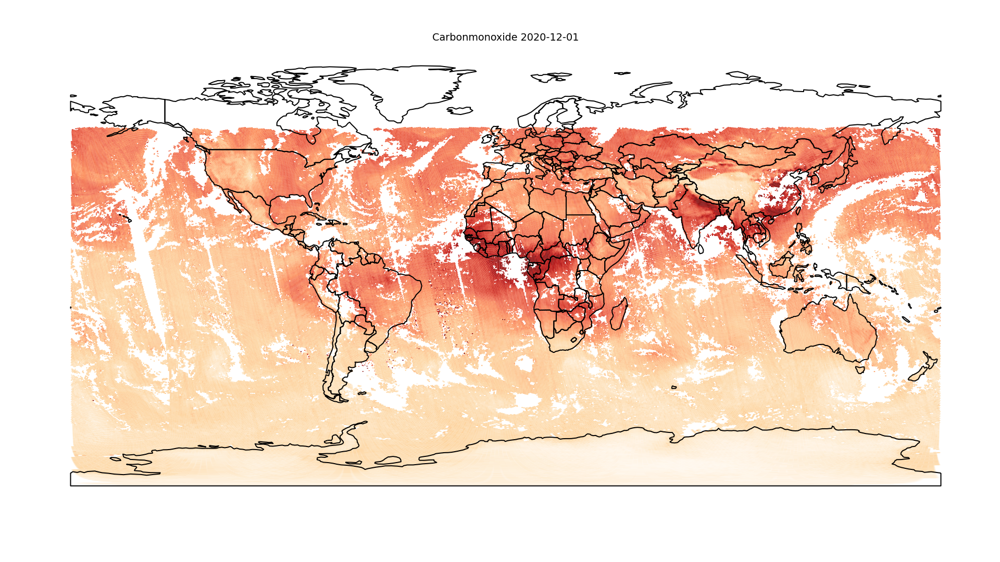

# Plotting Sentinel 5P Data *Part 2*

__Sven Haardiek, 2021-01-02__

Some time ago, while I was working on the [Emissions API Project](https://emissions-api.org), I wrote an article about [Plotting Sentinel 5P Data](plotting-sentinel-5p-data).
The main steps of the article were

1. Downloading the data from the [ESA](https://www.esa.int/) in  [NetCDF](https://de.wikipedia.org/wiki/NetCDF) format.
2. Loading the data into a [geopandas.GeoDataFrame](https://geopandas.org/reference/geopandas.GeoDataFrame.html).
3. Reducing the data using [Uber’s Hexagonal Hierarchical Spatial Index H3](https://eng.uber.com/h3/).
4. Plotting the data using [Matplotlib](https://matplotlib.org/).

This had some disadvantages.
We had to download a lot of data from the ESA, since we had to download a lot of additional informations and also reducing the data took quite a long time.

But since then the Emissions API Project has grown and so for completion I want to share with you a simpler method to plot beautiful images of world maps using the [API from Emissions API](https://api.v2.emissions-api.org) and a small tool called [Emissions API World Map Creator](https://github.com/emissions-api/emissionsapi-worldmap-creator).

Installing the Emissions API World Map Creator is pretty easy, since there is a [PyPi](emissionsapi-worldmap-creator) package.

```bash
# Creating a virtual environment
$ python -m venv venv
# Activate the virtual environment
$ . ./venv/bin/activate
# Install Emissions API World Map Creator
(venv) $ pip install emissionsapi-worldmap-creator
```

So now creating an world map is as easy as

```bash
(venv) $ emissionsapi-worldmap-creator ozone 2020-12-06
2021-01-02 11:38:16,790 - emissionsapi_worldmap_creator - Getting data.
2021-01-02 11:38:16,790 - emissionsapi_worldmap_creator - Downloading data from Emissions API
2021-01-02 11:38:46,488 - emissionsapi_worldmap_creator - Preparing the data
2021-01-02 11:39:31,756 - emissionsapi_worldmap_creator - Starting to plot
2021-01-02 11:39:32,060 - emissionsapi_worldmap_creator - Plotting hexagonal polygons
2021-01-02 11:40:10,750 - emissionsapi_worldmap_creator - Loading world map
2021-01-02 11:40:10,774 - emissionsapi_worldmap_creator - Plotting country borders
2021-01-02 11:40:10,795 - emissionsapi_worldmap_creator - Saving output to ozone-2020-12-06.png

```

In the background Emissions API World Map Creator is querying the API from Emissions API for the data, downloads them and plots the them as hexagons on a world map.

The result should look like this:


That is pretty easy, right?

The tool has a lot of more options to configure the image.
You can type `emissionsapi-worldmap-creator --help` to see which.
Most of them are pretty similar to the Matplotlib parameters.
Also the Emissions API World Map Creator is caching the data in `cache-<product>-<data>`.
So calling the image creation with other parameters will not download the data again and the process should speed up a bit.

So as a teaser at the end I will show you a little bit more complex call

```bash
(venv) $ emissionsapi-worldmap-creator --colormap OrRd --vmin 0.01 --vmax 0.05 --pixels_x 1920 --pixels_y 1080 --font-size 40 carbonmonoxide 2020-12-01

```

* `--vmin`, `--vmax` and `--colormap` changes the colormap, see [Matplotlib: Colormap](https://matplotlib.org/3.1.0/tutorials/colors/colormaps.html) and [Matplotlib: Colormap Normalization](https://matplotlib.org/3.1.1/tutorials/colors/colormapnorms.html) for more details.
* `--pixels_x` and `--pixels_y` create a image of the size 1920x1080.
* `--font-size` reduces the font size of the title.

This should look like:


