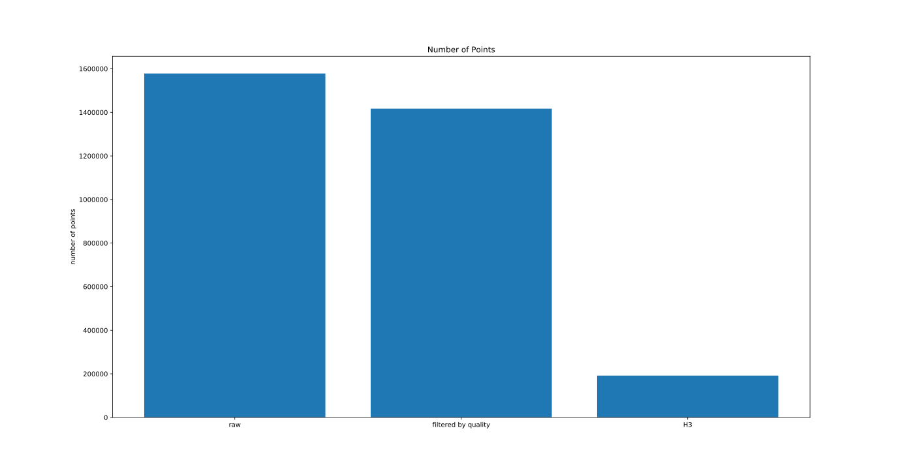
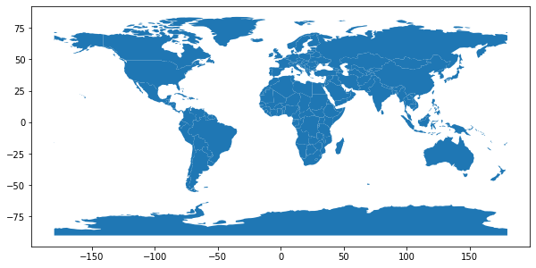
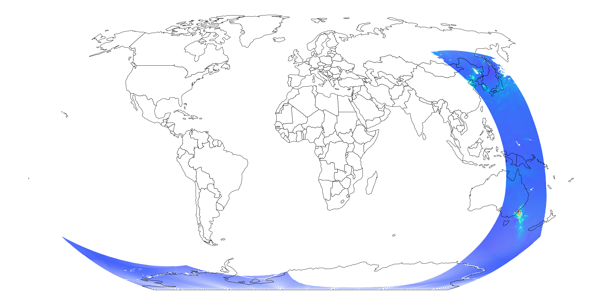

# Plotting Sentinel 5P Data

__Sven Haardiek, 2020-01-22__

[Sentinel 5P](http://www.esa.int/Applications/Observing_the_Earth/Copernicus/Sentinel-5P) is one of [ESA](https://www.esa.int/)'s earth observation satellites that are developed as part of the [Copernicus](https://www.esa.int/Applications/Observing_the_Earth/Copernicus) program.

It is dedicated to monitor air quality parameters and provides us with atmospheric concentrations of ozone, methane and nitrogen dioxide among [other](https://sentinel.esa.int/web/sentinel/missions/sentinel-5/data-products) trace gases of the atmosphere.

I am currently working with a small group of developers on a project called [Emissions API](https://emissions-api.org) that has the goal to create a web API to make it easier to access the data of Sentinel 5P and its successor, [Sentinel 5](https://earth.esa.int/web/guest/missions/esa-future-missions/sentinel-5).
As part of this work we created some lightweight libraries to download data from the servers of the ESA and to process their data products.
To verify that those libraries are working fine and to get a better understanding of the data, it is often useful to visualize the results.
In this post, I would like to share with you how to download the data from the ESA and generate plots with them.

So, at the end we should look at something like this:


## Preparation

We will be using the [Sentinel-5P Downloader](https://pypi.org/project/sentinel5dl/) to download the data from the ESA and [Sentinel-5 Algorithms](https://pypi.org/project/s5a/) to read and pre-process those data. Finally, for plotting we will be using [GeoPandas](http://geopandas.org/) which itself is using [Matplotlib](https://matplotlib.org/) and [Descartes](https://pypi.org/project/descartes/) internally.

You can install those dependencies like this:
```bash
$ pip install geopandas s5a sentinel5dl matplotlib descartes
```

Now we can download the data using the `sentinel5dl` binary.

```bash
$ mkdir -p data/S5P_OFFL_L2__NO2____
$ sentinel5dl --begin-ts '2019-12-31' --end-ts '2020-01-02' \
    --mode Offline --product 'L2__NO2___' data/S5P_OFFL_L2__NO2____
```

For this example, I chose to download nitrogen dioxide concentrations on New Year's Eve, in hope of finding a clear pattern of the air pollution from the fireworks on that day (but see for yourself at the end of this post).

The result from the download should look like this:

```bash
$ ls data/S5P_OFFL_L2__NO2____
S5P_OFFL_L2__NO2____20191231T011147_20191231T025317_11473_01_010302_20200101T180133.nc
S5P_OFFL_L2__NO2____20191231T011147_20191231T025317_11473_01_010302_20200101T180133.nc.md5sum
S5P_OFFL_L2__NO2____20191231T025317_20191231T043447_11474_01_010302_20200101T192226.nc
S5P_OFFL_L2__NO2____20191231T025317_20191231T043447_11474_01_010302_20200101T192226.nc.md5sum
...
S5P_OFFL_L2__NO2____20200101T192916_20200101T211046_11498_01_010302_20200103T121312.nc
S5P_OFFL_L2__NO2____20200101T192916_20200101T211046_11498_01_010302_20200103T121312.nc.md5sum
S5P_OFFL_L2__NO2____20200101T211046_20200101T225216_11499_01_010302_20200103T140339.nc
S5P_OFFL_L2__NO2____20200101T211046_20200101T225216_11499_01_010302_20200103T140339.nc.md5sum
```

We are interested in the `*.nc` files.
These are in the [NetCDF](https://de.wikipedia.org/wiki/NetCDF) format and contain a lot of data and associated metadata gathered from the satellite.
If you are interested in exploring those files yourself you can use a tool like [Panoply](https://www.giss.nasa.gov/tools/panoply/) for that.
To make it easier for us, we are using `s5a` to load the data. We are only interested in a very small subset of everything the `nc`-file has to offer and `s5a` loads only the valid data points along with some basic metadata.

In a first step, we will load one of the files:


```python
import s5a

data = s5a.load_ncfile(
    'data/S5P_OFFL_L2__NO2____/S5P_OFFL_L2__NO2____20191231T025317_20191231T043447_11474_01_010302_20200101T192226.nc'
)
```

`data` should now contain something like this:

<div>
<style scoped>
    .dataframe tbody tr th:only-of-type {
        vertical-align: middle;
    }

    .dataframe tbody tr th {
        vertical-align: top;
    }

    .dataframe thead th {
        text-align: right;
    }
</style>
<table border="1" class="dataframe">
  <thead>
    <tr style="text-align: right;">
      <th></th>
      <th>timestamp</th>
      <th>quality</th>
      <th>value</th>
      <th>longitude</th>
      <th>latitude</th>
    </tr>
  </thead>
  <tbody>
    <tr>
      <th>0</th>
      <td>2019-12-31 03:17:57.205000+00:00</td>
      <td>0.07</td>
      <td>-0.000011</td>
      <td>-15.975651</td>
      <td>-65.399246</td>
    </tr>
    <tr>
      <th>1</th>
      <td>2019-12-31 03:17:57.205000+00:00</td>
      <td>0.07</td>
      <td>-0.000019</td>
      <td>-16.178890</td>
      <td>-65.418892</td>
    </tr>
    <tr>
      <th>2</th>
      <td>2019-12-31 03:17:58.045000+00:00</td>
      <td>0.07</td>
      <td>-0.000006</td>
      <td>-15.965775</td>
      <td>-65.446426</td>
    </tr>
    <tr>
      <th>3</th>
      <td>2019-12-31 03:17:58.045000+00:00</td>
      <td>0.07</td>
      <td>-0.000012</td>
      <td>-16.169365</td>
      <td>-65.466110</td>
    </tr>
    <tr>
      <th>4</th>
      <td>2019-12-31 03:17:58.885000+00:00</td>
      <td>0.07</td>
      <td>-0.000010</td>
      <td>-15.955670</td>
      <td>-65.493546</td>
    </tr>
    <tr>
      <th>...</th>
      <td>...</td>
      <td>...</td>
      <td>...</td>
      <td>...</td>
      <td>...</td>
    </tr>
    <tr>
      <th>1578390</th>
      <td>2019-12-31 04:10:38.894000+00:00</td>
      <td>0.03</td>
      <td>-0.000070</td>
      <td>91.619942</td>
      <td>62.235840</td>
    </tr>
    <tr>
      <th>1578391</th>
      <td>2019-12-31 04:10:38.894000+00:00</td>
      <td>0.03</td>
      <td>-0.000045</td>
      <td>91.716927</td>
      <td>62.305752</td>
    </tr>
    <tr>
      <th>1578392</th>
      <td>2019-12-31 04:10:39.734000+00:00</td>
      <td>0.03</td>
      <td>-0.000052</td>
      <td>91.440414</td>
      <td>62.197773</td>
    </tr>
    <tr>
      <th>1578393</th>
      <td>2019-12-31 04:10:39.734000+00:00</td>
      <td>0.03</td>
      <td>-0.000070</td>
      <td>91.538177</td>
      <td>62.268784</td>
    </tr>
    <tr>
      <th>1578394</th>
      <td>2019-12-31 04:10:40.574000+00:00</td>
      <td>0.03</td>
      <td>-0.000075</td>
      <td>91.358582</td>
      <td>62.230633</td>
    </tr>
  </tbody>
</table>
<p>1578395 rows × 5 columns</p>
</div>

One and a half million points per data set is a lot.
Luckily `s5a` does have some functionality to reduce this.
First, note that every data point comes with a `quality` value (a basic measure of confidence in the _correctness_ of the measurement at hand).
With `s5a` we can drop points with poor quality quite easily.

```python
data = s5a.filter_by_quality(data)
```

Now our dataset has been reduced to 1416967 data points, which, unfortunately, is still too much.

To reduce those points even more,
`s5a` is using [Uber’s Hexagonal Hierarchical Spatial Index H3](https://eng.uber.com/h3/),
which is a grid system partitioning the earth into hexagons.
We will now calculate the H3 indices for every point,
then aggregate points with the same index by calculating the mean `value` and, finally, recalculate the `longitude` and `latitude` as the center of the hexagons.

```python
data = s5a.point_to_h3(data, resolution=5)
data = s5a.aggregate_h3(data)
data = s5a.h3_to_point(data)
```

The `resolution` parameter defines the size of the hexagons, with a resolution of 5 partitioning the world into approximately 2 million unique hexagons (for more detailed information, take a look at the [Table of Cell Areas for H3 Resolutions](https://uber.github.io/h3/#/documentation/core-library/resolution-table)).

So let's compare the number of points in the different sets.



With the steps above, we have reduced the number of points in our dataset and also have limited the total amount of points we have to plot for the whole world to approximately 2 millions.

Our last preparation will be converting the `pandas.core.frame.DataFrame` into a `geopandas.geodataframe.GeoDataFrame` to be able to use geopandas' spatial operations and plotting functionality.

```python
import geopandas

geometry = geopandas.points_from_xy(data.longitude, data.latitude)
data = geopandas.GeoDataFrame(data, geometry=geometry, crs={'init' :'epsg:4326'})
```

## Plotting the File

Our goal is to plot the values from the satellite on a map of the earth.
Lucky for us, GeoPandas does have one included.

```python
world = geopandas.read_file(geopandas.datasets.get_path('naturalearth_lowres'))
world.plot(figsize=(10, 5))
```



Our data and the world map have the same projection, so we can easily plot them together.
But since that projection is widely distorted on the poles, we are switching to the [Robinson projection](https://en.wikipedia.org/wiki/Robinson_projection).

```python
robinson_projection = '+a=6378137.0 +proj=robin +lon_0=0 +no_defs'
world = world.to_crs(robinson_projection)
data = data.to_crs(robinson_projection)
```

We can now plot the data of the one file we imported.
The explanation of the individual steps is given in the comments in the code.
If you are interested in more details, take a look at [GeoPandas Mapping](http://geopandas.org/mapping.html).

```python
import matplotlib.pyplot as plt

# Define base of the plot.
fig, ax = plt.subplots(1, 1, figsize=(40, 40), dpi=100)
# Disable the axes
ax.set_axis_off()
# Plot the data
data.plot(
    column='value',  # Column defining the color
    cmap='rainbow',  # Colormap
    marker='H',  # marker layout. Here a Hexagon.
    markersize=1,
    ax=ax,  # Base
    vmax=0.0005,  # Used as max for normalize luminance data
)

# Plot the boundary of the countries on top
world.geometry.boundary.plot(color=None, edgecolor='black', ax=ax)
```



Although this is the data of just one `nc`-file, we can already see a lot on this plot.
For one, we can see the path the satellite took while recording the data. We can also see that we do not have any data points in the north.
This is due to the fact that the satellite's spectrophotometer needs light to work and it is using the sunlight for that.
And since our data is from December, from a certain latitude up north, there is not enough sunlight available to conduct the measurments.

Also, we can see a high peak of nitrogen dioxide off the south eastern coast of Australia which probably stems from the bushfires.

## Plotting multiple Files

Finally, we will use all data we downloaded in the first step and put it into one single plot with an overview of the nitrogen dioxide values over the whole world.

To do that, we will first load all files and chain them together using [Pandas `concat`](https://pandas.pydata.org/pandas-docs/stable/reference/api/pandas.concat.html).
Next, we will be using the same techniques as before to reduce the data and create a `geopandas.geodataframe.GeoDataFrame`.

```python
import glob

import pandas


# Read in all files
data = []
for filename in glob.glob('data/S5P_OFFL_L2__NO2____/*.nc'):
    data.append(s5a.load_ncfile(filename))

# Combine points
data = pandas.concat(data, ignore_index=True)

# Reduce points
data = s5a.filter_by_quality(data)
data = s5a.point_to_h3(data, resolution=5)
data = s5a.aggregate_h3(data)
data = s5a.h3_to_point(data)

# Create geopandas dataframe
geometry = geopandas.points_from_xy(data.longitude, data.latitude)
data = geopandas.GeoDataFrame(data, geometry=geometry, crs={'init' :'epsg:4326'})

# Projection change
data = data.to_crs(robinson_projection)
```

Now we plot this data the same we way we did before and we will get this result:


We are not able to see a clear pattern of the fireworks around the world, but that might also be due to the fact that the satellite can only conduct measurements during the day and not around midnight. However, we can clearly see the impact of the bushfires in Australia and the pollution around the Beijing area in China.

If you want to try this yourself,
you can also take a look at this [Jupyter Notebook](https://nbviewer.jupyter.org/github/shaardie/sentinel5p-plots/blob/master/Scatter%20Plots.ipynb).

