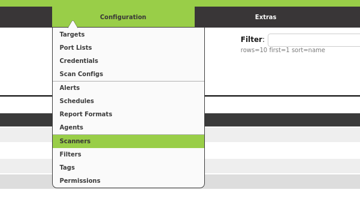
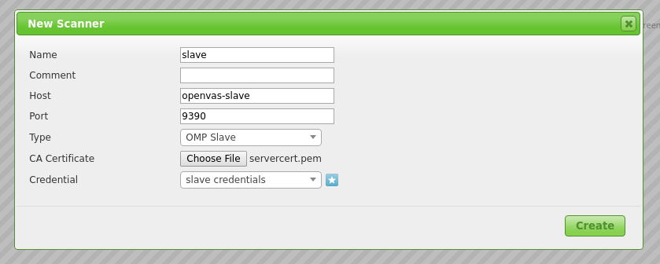
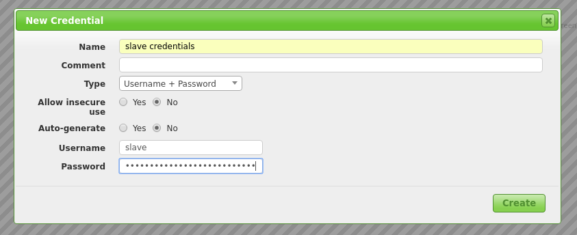
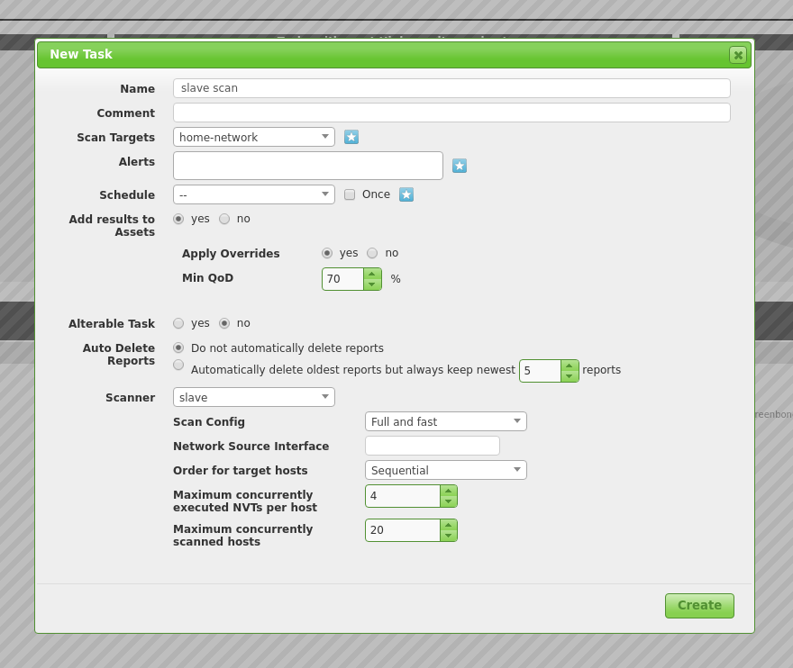

# Setup OpenVAS as Master and Slave

__Sven Haardiek, 2017-06-17__

**I did not work with OpenVAS since 2018 and do not update this guide with
every release. So if this guide is not working anymore and you need
information about the setup, please take a look at the [Greenbone Community
Forum](https://community.greenbone.net/).**

Did you ever want to connect your different [OpenVAS](http://openvas.org/)
installations and have all information about the vulnerabilities one one spot?
Or do you have very strict network policies and want scan a separate
sub-network, but do not want to browse your vulnerability in this sub-network?
Well, this is possible by using one OpenVAS installation as a __Master__ and
the other ones as __OMP Slaves__.

## Setup OpenVAS Installations

Before diving into the master-slave configuration, here a brief description how
I setup my OpenVAS installations.

Since OpenVAS is mostly developed on [Debian](https://www.debian.org/), I used
Debian Jessie as OS for the OpenVAS installations.

I installed OpenVAS 9, which is the latest stable version of OpenVAS at the
moment, but I do not install the Greenbone Security Assistant on the Slave.  I
do not want to connect to the slave via the Web interface, so I do not need it.

After installation, I did the casual things you have to do with a new OpenVAS
installation.  I set up the [Redis Server](https://redis.io/) using the
configuration from OpenVAS, generated certificates and private keys(
Although I do not need the certificate and private key for Greenbone Security
Assistant on the slave side, I was lazy and used `openvas-manage-certs -a` as
well on the master as on the slave) and downloaded the
[SCAP](https://scap.nist.gov/),
[CERT](https://en.wikipedia.org/wiki/Computer_emergency_response_team) and
[NVT](http://www.openvas.org/openvas-nvt-feed.html) data on both Master and
Slave.

Since I do not want to start the daemons on the master and sensors manually, I
created some [Systemd](https://www.freedesktop.org/wiki/Software/systemd/)
service files. If you are interested, I stored them
[here](https://gist.github.com/shaardie/19ed2fcc6187d3663014cdbcae579e02).
You are free to use them.

That is my setup. So now let us talk about master-slave configuration.

## On the Slave Side

As you probably already noticed, I used different Systemd service files for
the OpenVAS Manager on the Master and on the Slave side. This is because I want
to directly connect to OpenVAS Manager on the slave and therefore it has
to listen globally. This can be achieved by starting the OpenVAS Manager with
`listen=0.0.0.0`. A `netstat` call later we also know it listens on Port
__9390__.

```bash
openvas-slave$ netstat -tulpen
Active Internet connections (only servers)
Proto Recv-Q Send-Q Local Address           Foreign Address         State       User       Inode       PID/Program name
...
tcp        0      0 0.0.0.0:9390            0.0.0.0:*               LISTEN      0          11430       401/openvasmd
...
```

The OpenVAS Manager authenticate itself using a certificate. To later be able
to verify this communication we need to know this certificate. The certificate
the OpenVAS Manager uses can be found under
`${CMAKE_INSTALL_PREFIX}"/var/lib/openvas/CA/servercert.pem`.
So without changing the CMake variables it can be found under
`/usr/local/var/lib/openvas/CA/servercert.pem`. Save this file somewhere to
be able to use it on the master side later.

We also need a OpenVAS Manager user to connect to. Therefore we simply create
one

```bash
openvas-slave$ openvasmd --create-user slave
User created with password '263383eb-3234-4114-b3bb-f6b78e95982d'.
```

Now we can move on to the master.

## On the Master Side

Login to the Greenbone Security Assistant (If you do not have a user to connect
to it, now is the time to create one) and go to _Configuration -> Scanners_.



Create a new Scanner using the star symbol. Now you have to fill in the form.
Here is how the filled in form looked in my installation.



 * __Host__: Hostname or IP of your Slave
 * __Port__: `9390`, as seen in the previous section
 * __Type__: `OMP Slave`
 * __CA Certificate__: The certificate you gathered from the slave

As __Credentials__ you have to use the user you created on the slave. You can
simply use the star symbol again to create it on-the-fly.



After you have created your new Slave Scanner, you can use it to scans.



Tada! A slave scan.
